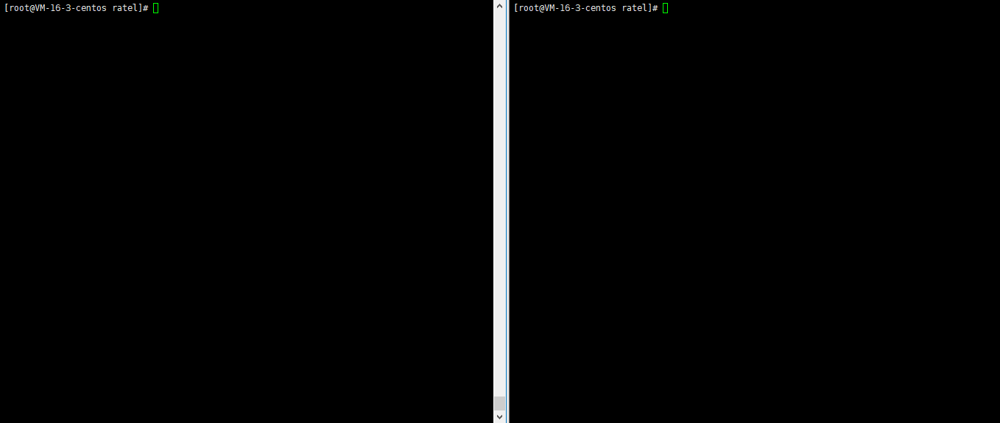

## 指令
- `s`：开始游戏
- `v`：刷新可用房间列表/查看房间成员/查看其它玩家游戏状态
- `e`：退出/返回
- `y`：确定
- `f`：取消
- `p`：不出
 
## 规则
```
        |3  |4  |5  |6  |7  |8  |9  |10 |J  |Q  |K  |A    |2  |S  |X  |
input ->|3  |4  |5  |6  |7  |8  |9  |0  |J j|Q q|K k|A a 1|2  |S s|X x|
```
### 举例：
 - 4个2：`2222`
 - 王炸：`sx`
 - 3~A顺子：`34567890jqka`
 - 3带1：`3334`
 - 飞机：`jjjqqq34`

## 演示
